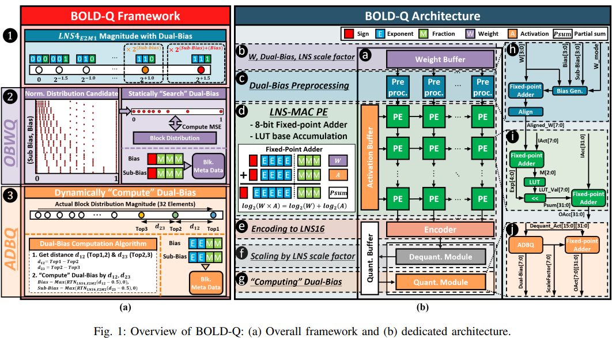
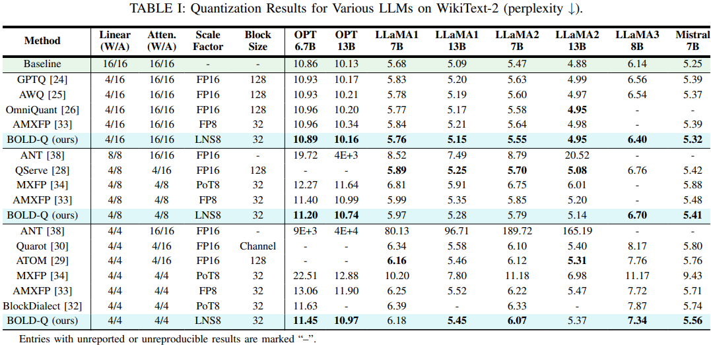

# BOLD-Q

The official PyTorch implementation of BOLD-Q, an HW/SW co-designed quantization framework combining LNS and microscaling for efficient low-precision LLM inference [DATE 2026].

## Overview

BOLD-Q is a blockwise MX-based quantization pipeline for large language models with LNS-style low-precision formats. This repository focuses on perplexity evaluation with optional SmoothQuant preprocessing, MX operator injection, and pre-quantized linear weight caching.

The current evaluation flow is centered on:

- MX-based weight and activation quantization
- pre-quantized layer weight caching
- perplexity evaluation on `wikitext2`
- SmoothQuant preprocessing



## Scope

At this stage, the released code currently focuses on reproducing the 4-bit weight / 4-bit activation setting only.

## Implementation Note

We additionally provide an optional SmoothQuant preprocessing path in the codebase. This component was included in the implementation because it was needed for reproduction, although it was not described in the paper due to space limitations.

## Installation

Clone this repo:

```bash
git clone https://github.com/IDSL-SeoulTech/BOLD-Q.git
cd BOLD-Q/
```

The code is tested with Python 3.9. We recommend using Conda to create the environment for this project.

Create an Anaconda environment:

```bash
conda create -n bold-q python=3.9 -y
conda activate bold-q
```

Install PyTorch for your system first by following the official guide:

https://pytorch.org/get-started/locally/

For example, for CUDA 11.8:

```bash
pip install --extra-index-url https://download.pytorch.org/whl/cu118 \ torch torchvision torchaudio
```

Install the project dependencies:

```bash
pip install -r requirements.txt
```

## How to Use

The main entry point is `mx_main.py`, and a default example script is provided in `scripts/eval.sh`.

### Example Script

```bash
bash scripts/eval.sh
```

### Example Command

```bash
CUDA_VISIBLE_DEVICES=0 \
python mx_main.py \
    --model meta-llama/Llama-2-7b-hf \
    --output_dir ./log \
    --mx \
    --scale_bits 8 \
    --w_elem_format lns4_e2m1 \
    --a_elem_format lns4_e2m1 \
    --block_size 32 \
    --bfloat 16 \
    --lns_mode \
    --prequantized \
    --eval_ppl \
    --smoothquant
```

## Main Arguments

The current workflow primarily uses the following arguments:

- `--model`: Hugging Face model name or local path
- `--output_dir`: directory for logs
- `--mx`: enable MX quantized ops
- `--scale_bits`: shared exponent bit width
- `--w_elem_format`: MX format for weights
- `--a_elem_format`: MX format for activations
- `--block_size`: MX block size
- `--bfloat`: bfloat format setting used by the current pipeline
- `--lns_mode`: enable LNS-based MX processing
- `--prequantized`: pre-quantize and reload linear weights
- `--eval_ppl`: run perplexity evaluation
- `--smoothquant`: run SmoothQuant preprocessing

## Output

- Logs are written to `./log`
- Cached evaluation data is written to `./cache`
- Pre-quantized layer weights are written to `./quantized_layer_weights`

## Results

### PPL Evaluation



## Related Projects

- [An empirical study of LLaMA3 quantization: from LLMs to MLLMs](https://github.com/Macaronlin/LLaMA3-Quantization/tree/master)
- [Microscaling Data Formats for Deep Learning](https://github.com/microsoft/microxcaling)
- [SmoothQuant: Accurate and Efficient Post-Training Quantization for Large Language Models](https://github.com/mit-han-lab/smoothquant)
